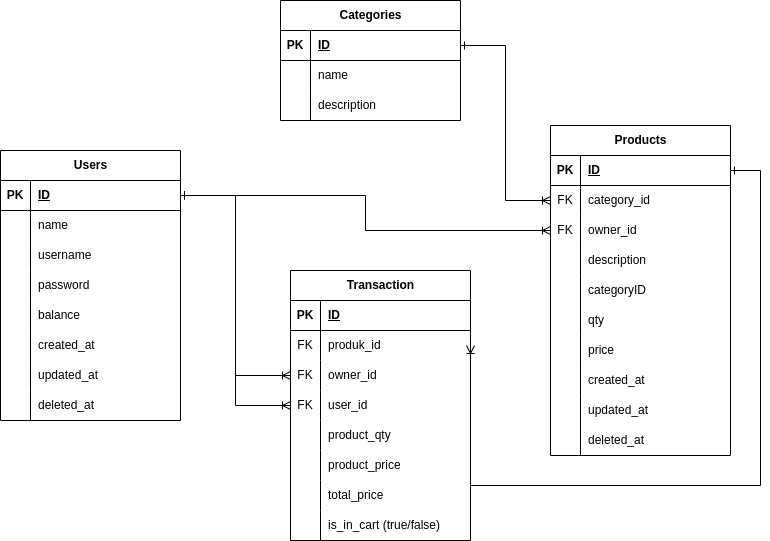

## Table of Contents

- [ERD](#ERD)
- [Requirements](#requirements)
- [Instalation](#instalation)
- [App Flow](#app-flow)
- [Documentation](#documentation)


# ERD



## Setup local development

### Install tools

- [Docker hub](https://hub.docker.com/)
- [Golang](https://golang.org/)
- [Migrate](https://github.com/golang-migrate/migrate/tree/master/cmd/migrate)
- Postgres

### Setup infrastructure
- Start postgres container:
    ```bash
    make postgres
    ```
- Create simple_bank database:
    ```bash
    make createdb
    ```
- Run db migration:
    ```bash
    make migrateup
    ```

## App Flow
- Register User
- Login User
- Add Category
- Add Product
- Add Product to Cart
- Checkout Product

### Postman Documentation
[https://documenter.getpostman.com/view/14858801/2s9YeD9DMX](https://documenter.getpostman.com/view/14858801/2s9YeD9DMX)